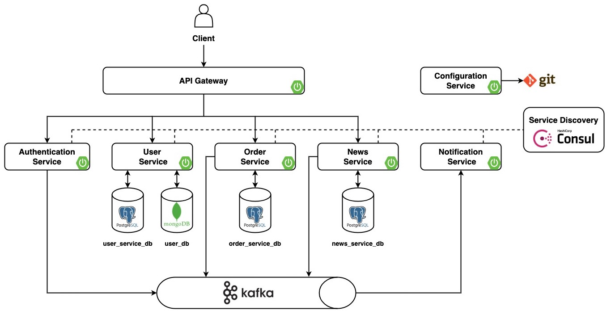

# Fitness Club CRM

## Description

This project aims to address the complexities associated with managing the operations of a Fitness Club. It is designed
to cater to both sports organizations seeking a streamlined system for managing activities and users who require a
simple and convenient platform to register for training sessions and provide feedback to trainers. By implementing the
Fitness Club CRM, organizations can automate club management processes, enhance customer interactions, improve
customer service quality, and ultimately boost profitability.

## Abilities

The project offers the following capabilities to different user roles:

* Guests can:
    * Browse through:
        * Training programs and sessions;
        * Trainers' staff information;
        * Details about the Fitness Club;
        * News and articles related to a healthy lifestyle and fitness club events;
    * Register for an account;
    * Log in to their account.

* Users, in addition to the above features, can:
    * Access the training schedule;
    * Register for desired training sessions;
    * Check their registration information and past training sessions;
    * Manage their personal account and update personal information.

* Trainers have the ability to:
    * View information about other trainers;
    * Access brief information on users who have registered for their training sessions;
    * Manage the training schedule;
    * Manage the status of applications for training sessions.

* Administrators have the authority to manage:
    * Trainings;
    * Training schedule;
    * Trainers;
    * Users;
    * Statuses of training session applications;
    * News related to a healthy lifestyle and fitness club events.

***

## Architecture

The project was implemented according to microservice architecture.

It has the following microservices:

* **Authentication Service** is serving the operations of signin, signup and signout.
* **User Service** is responsible for user management.
* **Order Service** is in charge of managing services, schedules, and orders.
* **News Service** is tasked with the management of news content. It enables the creation, updating, and retrieval of
  news from external APIs.
* **Notification Service** takes charge of managing notifications. It is responsible for handling the creation,
  delivery, and overall management of notifications.
* **API Gateway** is responsible for routing the incoming requests to downstream services.
* **Configuration Service** acts as a remote config service.



## Requirements

For building and running the application you need:

* [Java JDK 15+](https://www.oracle.com/java/technologies/javase/jdk15-archive-downloads.html)
* [Gradle v6.0+](https://gradle.org/releases/)
* [Git](https://git-scm.com/downloads)
* [Docker](https://www.docker.com/)
* [Minikube](https://kubernetes.io/ru/docs/tasks/tools/install-minikube/) (Additional)

## Get Started

### Cloning

```console
$ git clone https://github.com/ShevelyanchikAlex/fitness-club-crm.git
```

### Building

Being in the root directory:

```console
$ gradle clean build
```

### Running

The project includes **docker-compose** for -prod, -dev, -test versions.

Being in the root directory:

```console
$ cd docker
```

#### Prod version

To run the -prod version with all configured environments and services run the following command:

```console
$ docker-compose -f docker-compose-prod.yml up -d
```

Containers for all services will be launched. The project can be reached at http://localhost:8765/api/v1/**.

#### Dev version

To run the -dev version with all configured dev-environments run the following command:

```console
$ docker-compose -f docker-compose-dev.yml up -d
```

Containers for dev-work of services will be launched.
After it is required to start all services locally.
The project can be reached at http://localhost:8765/api/v1/**.

#### Test version

To run the -test version with all configured test-environments run the following command:

```console
$ docker-compose -f docker-compose-test.yml up -d
```

Containers for test-work of services will be launched.
After that it is possible to run all types of tests in services.
